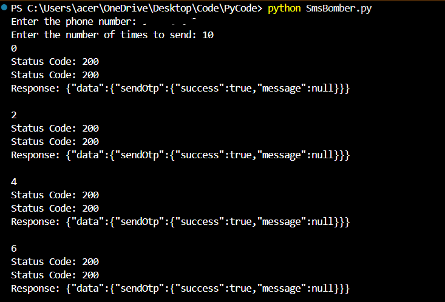

# OTP Request Generator

This project demonstrates an **SMS Request Flooder** using **Python** and **Burp Suite** to capture OTP request packets and replay them.  
⚠️ This tool is built strictly for **educational and cybersecurity research purposes only**. Misuse of this script is illegal and unethical.

---

## Features
- Captures and analyzes OTP request endpoints using **Burp Suite**  
- Replays OTP requests via a Python script using the **requests** library  
- Alternates between multiple endpoints to bypass rate limiting  
- Custom headers, payloads, and cookies to replicate real browser behaviour  
- Input validation & loop control for efficient execution  
- Logs responses with status codes for debugging  

---

## Tools & Technology
- **Python 3**
- **Burp Suite (Community Edition is enough)**
- **Requests library**

---

## Setup Instructions

1. Clone the repository:
   ```bash
   git clone https://github.com/Lightsaber2/otp-request-generator.git
   cd otp-request-generator
   ```

2. Install dependencies:
   ```bash
   pip install requests
   ```

3. Run the script:
   ```bash
   python SmsBomber.py
   ```

---

## Example Run

Below is a sample output of the script execution:



---

## Methodology
1. Intercepted OTP request packets using **Burp Suite**.  
2. Identified exploitable parameters (number, headers, body).  
3. Wrote a Python script to repeatedly send these requests.  
4. Implemented random switching and validation for stealth.  
5. Captured and logged success responses.

---

## Legal & Ethical Disclaimer
This project is intended **only for cybersecurity research and educational purposes**.  
- Do **not** use this tool on numbers without explicit permission.  
- The author is **not responsible** for misuse or legal consequences.  

---

## 📧 Contact
For research or collaboration inquiries:  
**Yash Srivastava**  
GitHub: https://github.com/Lightsaber2
